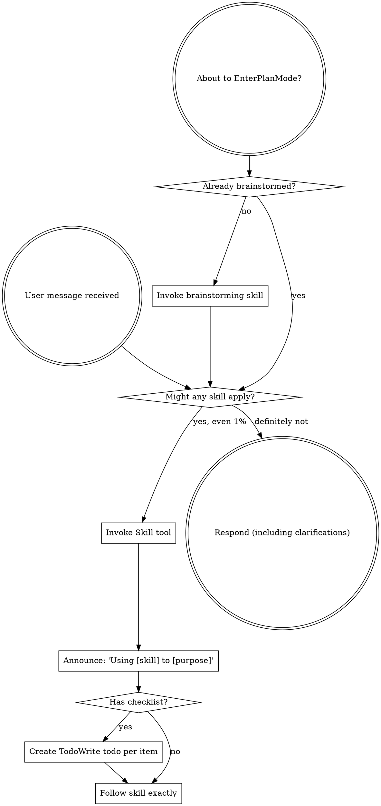

<SUBAGENT-STOP>
If you were dispatched as a subagent to execute a specific task, skip this skill.
</SUBAGENT-STOP>

<FORK-NOTICE>
**You are running `superpowers-deepseek-v4`, a fork of `obra/superpowers` 5.1.0 tuned for DeepSeek-V4-Pro.**

This fork is NOT a drop-in replacement of upstream. Several core SKILLs have been refactored and new SKILLs have been added. Adapt your workflow accordingly.

**Why this fork exists**: DeepSeek-V4-Pro scores low on architecture / design / review tasks. This fork mitigates that via (1) exemplar-sample alignment to raise output stability and (2) a multi-reviewer subsystem that breaks single-context blind spots through parallel independent reviewers + an arbiter + multi-round convergence.

**Key differences from upstream `obra/superpowers`:**

1. **`brainstorming` is now two-phase.** Phase A is human-driven alignment Q&A (recorded to `docs/superpowers/brainstorms/<date>-<topic-slug>-brainstorm.md`). Phase B is agent-driven spec writing + multi-reviewer loop. Step 0 strictly invokes `superpowers:resume-brainstorming` first.

2. **`writing-plans` is rewritten.** Step 0 strictly invokes `superpowers:resume-planning`, which forces a mandatory source-spec selection from `Done` brainstorming sessions. Progress is tracked in `docs/superpowers/brainstorms/<date>-<topic-slug>-plan-progress.md`. Reviews go through the multi-reviewer subsystem.

3. **NEW SKILL `superpowers:multi-reviewer`** — replaces the old single-reviewer prompts. Dispatches 4 fixed reviewers (architect, red-team, edge-cases, yagni-gatekeeper) + 0–2 exemplar-matchers in parallel, plus an arbiter that filters / dedups / arbitrates. Has 5-layer convergence rules (50% degradation check + 3-round hard cap) and a user-arbitration handoff for unresolved findings. Called by both `brainstorming` (Phase B) and `writing-plans`.

4. **NEW exemplar samples library** at `samples/specs/` + `samples/plans/`, indexed by `INDEX.md`. Both `brainstorming` Phase B and `writing-plans` match the current task against the INDEX (cap 2 samples) before drafting; each matched sample also spawns one dedicated `exemplar-matcher` reviewer in the multi-reviewer loop. Zero matches → multi-reviewer runs with 4 reviewers instead of 5–6.

5. **NEW SKILL `superpowers:managing-samples`** — STRICTLY user-driven. Use ONLY when the user explicitly says "initialize the samples library" or "add `<file>` as a sample". Never auto-trigger; never proactively recommend "save this as a sample".

6. **NEW SKILLs `superpowers:resume-brainstorming` and `superpowers:resume-planning`** — lifecycle SKILLs for the decision-log / plan-progress files. They list past sessions and let the user resume an `In Progress` session, start a new session based on a `Done` or `Abandoned` prior session, or abandon an existing one. Both `brainstorming` and `writing-plans` invoke them as Step 0.

**What is unchanged**: all other SKILLs (TDD, debugging, subagent-driven-development, requesting-code-review, etc.) are byte-identical to upstream 5.1.0. Skill-discovery mechanics, `<HARD-GATE>` semantics, red-flag tables, and user-instruction priority are preserved.

**Reference docs**: `docs/superpowers/specs/2026-05-16-deepseek-v4-pro-optimization-design.md` (design rationale) and `docs/superpowers/plans/2026-05-16-deepseek-v4-pro-optimization.md` (implementation plan).
</FORK-NOTICE>

<EXTREMELY-IMPORTANT>
If you think there is even a 1% chance a skill might apply to what you are doing, you ABSOLUTELY MUST invoke the skill.

IF A SKILL APPLIES TO YOUR TASK, YOU DO NOT HAVE A CHOICE. YOU MUST USE IT.

This is not negotiable. This is not optional. You cannot rationalize your way out of this.
</EXTREMELY-IMPORTANT>

## Instruction Priority

Superpowers skills override default system prompt behavior, but **user instructions always take precedence**:

1. **User's explicit instructions** (CLAUDE.md, GEMINI.md, AGENTS.md, direct requests) — highest priority
2. **Superpowers skills** — override default system behavior where they conflict
3. **Default system prompt** — lowest priority

If CLAUDE.md, GEMINI.md, or AGENTS.md says "don't use TDD" and a skill says "always use TDD," follow the user's instructions. The user is in control.

## How to Access Skills

**In Claude Code:** Use the `Skill` tool. When you invoke a skill, its content is loaded and presented to you—follow it directly. Never use the Read tool on skill files.

**In Copilot CLI:** Use the `skill` tool. Skills are auto-discovered from installed plugins. The `skill` tool works the same as Claude Code's `Skill` tool.

**In Gemini CLI:** Skills activate via the `activate_skill` tool. Gemini loads skill metadata at session start and activates the full content on demand.

**In other environments:** Check your platform's documentation for how skills are loaded.

## Platform Adaptation

Skills use Claude Code tool names. Non-CC platforms: see `references/copilot-tools.md` (Copilot CLI), `references/codex-tools.md` (Codex) for tool equivalents. Gemini CLI users get the tool mapping loaded automatically via GEMINI.md.

# Using Skills

## The Rule

**Invoke relevant or requested skills BEFORE any response or action.** Even a 1% chance a skill might apply means that you should invoke the skill to check. If an invoked skill turns out to be wrong for the situation, you don't need to use it.

## Red Flags

These thoughts mean STOP—you're rationalizing:

| Thought | Reality |
|---------|---------|
| "This is just a simple question" | Questions are tasks. Check for skills. |
| "I need more context first" | Skill check comes BEFORE clarifying questions. |
| "Let me explore the codebase first" | Skills tell you HOW to explore. Check first. |
| "I can check git/files quickly" | Files lack conversation context. Check for skills. |
| "Let me gather information first" | Skills tell you HOW to gather information. |
| "This doesn't need a formal skill" | If a skill exists, use it. |
| "I remember this skill" | Skills evolve. Read current version. |
| "This doesn't count as a task" | Action = task. Check for skills. |
| "The skill is overkill" | Simple things become complex. Use it. |
| "I'll just do this one thing first" | Check BEFORE doing anything. |
| "This feels productive" | Undisciplined action wastes time. Skills prevent this. |
| "I know what that means" | Knowing the concept ≠ using the skill. Invoke it. |

## Skill Priority

When multiple skills could apply, use this order:

1. **Process skills first** (brainstorming, debugging) - these determine HOW to approach the task
2. **Implementation skills second** (frontend-design, mcp-builder) - these guide execution

"Let's build X" → brainstorming first, then implementation skills.
"Fix this bug" → debugging first, then domain-specific skills.

## Skill Types

**Rigid** (TDD, debugging): Follow exactly. Don't adapt away discipline.

**Flexible** (patterns): Adapt principles to context.

The skill itself tells you which.

## User Instructions

Instructions say WHAT, not HOW. "Add X" or "Fix Y" doesn't mean skip workflows.
